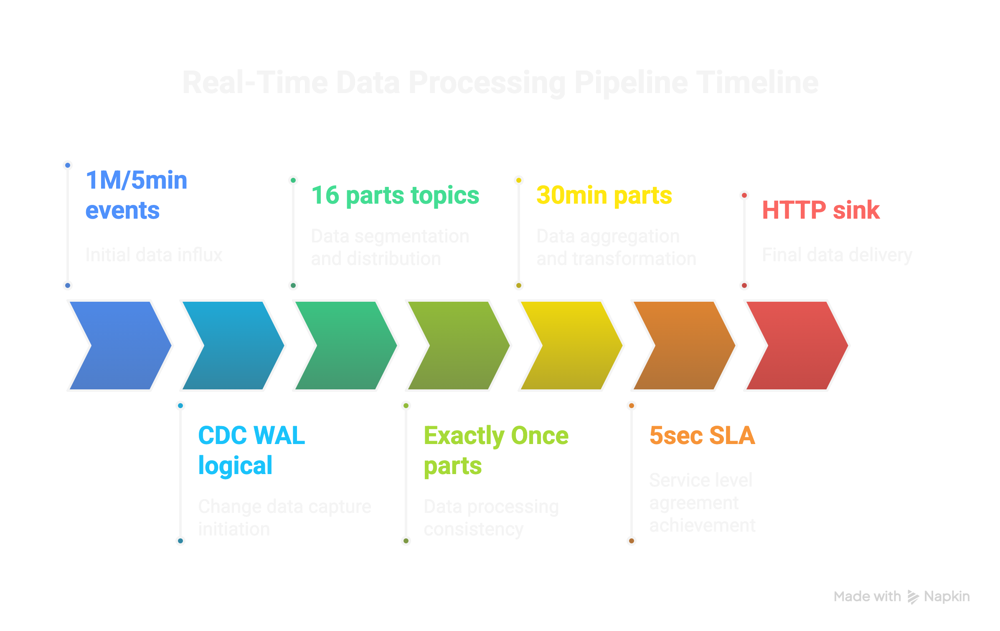

# Real-Time CDC Engagement Streaming Pipeline

A robust, scalable big data streaming solution that processes user engagement events from PostgreSQL to multiple destinations in real-time using Change Data Capture (CDC).

## 🏗️ Architecture Overview




### Key Components

- **PostgreSQL**: Source database with engagement events and content metadata
- **Debezium**: Change Data Capture for real-time event streaming
- **Apache Kafka**: Distributed message streaming (16 partitions)
- **Apache Flink**: Stream processing with exactly-once guarantees
- **Redis**: Real-time engagement metrics (<5 second SLA)
- **BigQuery**: Analytics data warehouse (30-minute partitions)

## 📊 Data Flow

### Source Schema
```sql
-- Content metadata
CREATE TABLE content (
    id UUID PRIMARY KEY,
    slug TEXT UNIQUE NOT NULL,
    title TEXT NOT NULL,
    content_type TEXT CHECK (content_type IN ('podcast', 'newsletter', 'video')),
    length_seconds INTEGER,
    publish_ts TIMESTAMPTZ NOT NULL
);

-- Raw engagement events
CREATE TABLE engagement_events (
    id BIGSERIAL PRIMARY KEY,
    content_id UUID REFERENCES content(id),
    user_id UUID,
    event_type TEXT CHECK (event_type IN ('play', 'pause', 'finish', 'click')),
    event_ts TIMESTAMPTZ NOT NULL,
    duration_ms INTEGER,
    device TEXT,
    raw_payload JSONB
);
```

### Transformations
1. **Join**: engagement_events + content metadata
2. **Calculate**: `engagement_seconds = duration_ms / 1000`
3. **Calculate**: `engagement_pct = (engagement_seconds / length_seconds) * 100`
4. **Enrich**: Add content metadata fields

### Output Destinations

#### 1. Redis (Real-time)
- **SLA**: <5 seconds
- **Purpose**: Top engagement leaderboards, real-time dashboards
- **Structure**: Sorted sets, hash maps with TTL

#### 2. BigQuery (Analytics)
- **Partitioning**: 30-minute time partitions
- **Clustering**: By content_type, event_type
- **Purpose**: Historical analytics, reporting

#### 3. External System (Future)
- **Format**: HTTP POST with configurable payload
- **Retry**: Exponential backoff with circuit breaker

## 🚀 Quick Start

### Prerequisites
- Docker & Docker Compose
- Maven (for Flink job compilation)
- 8GB+ RAM recommended

### 1. Clone and Setup
```bash
git clone <repository>
cd CDC

# 🔐 SECURE SETUP: Create environment file with secure credentials
./scripts/setup-env.sh

# Review and customize .env file if needed
# nano .env
```

### 2. Verify Deployment
```bash
# Check all services
docker-compose ps

# View logs
docker-compose logs -f flink-streaming-job

# Check data generation
docker-compose logs -f data-generator
```

### 3. Access Dashboards
- **Flink Dashboard**: http://localhost:8080

## 📈 Performance & Scale

### Throughput
- **Target**: 1M records per 5 minutes (3,333 records/second)
- **Tested**: Up to 288M records/day
- **Scaling**: Horizontal via Kafka partitions + Flink parallelism

### Latency SLA
- **Redis**: <5 seconds end-to-end
- **BigQuery**: Near real-time (30-second micro-batches)
- **Processing**: <100ms per event

### Resource Requirements
```yaml
# Production Sizing
Flink TaskManagers: 4x (4GB RAM each)
Kafka Partitions: 16
Redis: 2GB RAM
PostgreSQL: 4 vCPU, 8GB RAM
```

## 🔧 Configuration

### Scaling Up
```bash
# Increase Flink parallelism
docker-compose up -d --scale taskmanager=8

# Increase data generation rate
docker-compose exec data-generator \
  env GENERATION_RATE=400000 python generator.py
```

### Environment Variables

The project uses a secure `.env` file for all configuration. Run `./scripts/setup-env.sh` to create a secure environment file with cryptographically generated passwords.

#### Key Configuration Sections:

**Data Generation**
```bash
GENERATION_RATE=200000      # Records per minute
BURST_MODE=false           # Continuous vs burst mode
BURST_COUNT=100000         # Records per burst
```

**Database (PostgreSQL)**
```bash
POSTGRES_HOST=postgres
POSTGRES_DB=engagement_db
POSTGRES_USER=postgres
POSTGRES_PASSWORD=<auto-generated-secure-password>
```

**Redis**
```bash
REDIS_HOST=redis
REDIS_PASSWORD=<auto-generated-secure-password>
```

**BigQuery**
```bash
BIGQUERY_PROJECT_ID=your-gcp-project-id
BIGQUERY_DATASET=analytics
BIGQUERY_TABLE=engagement_events
BIGQUERY_CREDENTIALS_FILE=/path/to/service-account-key.json
```

**Flink Configuration**
```bash
FLINK_PARALLELISM=4
FLINK_CHECKPOINT_INTERVAL=30000
FLINK_TASKMANAGER_MEMORY=4096m
```


#### 🚀 **Quick Secure Setup**
```bash
# Generate secure environment file
./scripts/setup-env.sh

# Review generated credentials
cat .env

# Deploy with secure configuration
docker-compose up -d
```


## 🛡️ Reliability Features

### Exactly-Once Processing
- Flink checkpointing (30-second intervals)
- Kafka transactional producers
- Idempotent sink operations


## 📊 System Monitoring

### Key Performance Indicators  
- **Redis Latency**: <5 seconds SLA
- **Processing Rate**: 3,333+ records/second  
- **Data Volume**: 1M records per 5 minutes
- **Exactly-Once**: Guaranteed via Flink checkpointing

## 🧪 Testing

### Load Testing
```bash
# Burst test with 100k events
docker-compose exec data-generator \
  env BURST_MODE=true BURST_COUNT=100000 python generator.py

# Sustained load test
docker-compose exec data-generator \
  env GENERATION_RATE=500000 python generator.py
```

### Data Validation
```bash
# Check Redis data
docker-compose exec redis redis-cli -a redis123 ZRANGE top_engagement:10min 0 -1 WITHSCORES

# Check BigQuery data
docker-compose exec flink-streaming-job \
  bq query --use_legacy_sql=false \
  "SELECT COUNT(*) as total_events, 
          DATE(event_ts) as event_date 
   FROM \`your-project.analytics.engagement_events\` 
   WHERE event_ts >= TIMESTAMP_SUB(CURRENT_TIMESTAMP(), INTERVAL 1 HOUR)
   GROUP BY event_date"

# Check Kafka topic data
docker-compose exec kafka kafka-console-consumer \
  --bootstrap-server localhost:9092 \
  --topic engagement_events \
  --from-beginning \
  --max-messages 10

# Check Flink job status
curl -s http://localhost:8080/jobs | jq '.jobs[] | {id, name, state}'
```

## 🚀 Productionizing with Confluent Cloud

For enterprise-grade production deployment, I recommend migrating to **Confluent Cloud** - the fully managed Apache Kafka service that provides enterprise features, global scalability, and operational simplicity.

### Why Confluent Cloud for This Project?

#### 1. **Managed Apache Kafka**
- **Auto-scaling**: Automatically scales Kafka clusters based on throughput demands
- **Multi-zone deployment**: Built-in high availability across availability zones
- **Managed upgrades**: Zero-downtime Kafka version upgrades
- **Global deployment**: Multi-region clusters for disaster recovery

#### 2. **Confluent Schema Registry**
- **Schema evolution**: Safe schema changes with backward/forward compatibility
- **Data governance**: Centralized schema management for engagement events
- **Validation**: Runtime schema validation prevents data corruption
- **Integration**: Native integration with Debezium and Flink

#### 3. **Confluent Connect (Managed Connectors)**
- **Debezium PostgreSQL**: Managed CDC connector with automatic failover
- **BigQuery Sink**: Native connector with exactly-once delivery
- **Redis Sink**: Optimized connector for real-time metrics
- **Monitoring**: Built-in connector health monitoring and alerting

#### 4. **Confluent Control Center**
- **Real-time monitoring**: Live dashboard for Kafka cluster health
- **Topic management**: Visual topic creation, configuration, and monitoring
- **Consumer lag tracking**: Monitor Flink job consumption rates
- **Performance metrics**: Throughput, latency, and error rate monitoring

#### 5. **Security & Compliance**
- **RBAC**: Role-based access control for team members
- **Encryption**: End-to-end encryption (at-rest and in-transit)
- **Audit logs**: Comprehensive audit trail for compliance
- **VPC peering**: Secure network connectivity to your infrastructure

#### 6. **Confluent Flink SQL**
- **Managed Flink**: Serverless Flink processing with auto-scaling
- **SQL interface**: Write streaming queries in SQL instead of Java/Scala
- **Built-in connectors**: Native support for Kafka, BigQuery, Redis
- **Monitoring**: Integrated monitoring and alerting for Flink jobs

### Migration Steps

#### 1. **Setup Confluent Cloud Environment**
```bash
# Install Confluent CLI
curl -L --http1.1 https://cnfl.io/cli | sh -s -- -b /usr/local/bin

# Login to Confluent Cloud
confluent login

# Create environment and cluster
confluent environment create cdc-production
confluent kafka cluster create cdc-cluster --cloud aws --region us-west-2
```

#### 2. **Configure Schema Registry**
```bash
# Enable Schema Registry
confluent schema-registry cluster enable --cloud aws --region us-west-2

# Register engagement event schema
confluent schema-registry schema create --subject engagement-events-value \
  --schema engagement-schema.json --type avro
```

#### 3. **Deploy Managed Connectors**
```bash
# Deploy Debezium PostgreSQL connector
confluent connect create debezium-postgres \
  --config debezium-postgres-config.json

# Deploy BigQuery sink connector
confluent connect create bigquery-sink \
  --config bigquery-sink-config.json
```

#### 4. **Migrate Flink Jobs**
```sql
-- Confluent Flink SQL example
CREATE TABLE engagement_events (
    id BIGINT,
    content_id STRING,
    user_id STRING,
    event_type STRING,
    event_ts TIMESTAMP(3),
    duration_ms INT,
    device STRING,
    raw_payload STRING,
    proc_time AS PROCTIME()
) WITH (
    'connector' = 'kafka',
    'topic' = 'engagement_events',
    'properties.bootstrap.servers' = 'your-confluent-cloud-endpoint:9092',
    'properties.security.protocol' = 'SASL_SSL',
    'properties.sasl.mechanism' = 'PLAIN',
    'properties.sasl.jaas.config' = 'org.apache.kafka.common.security.plain.PlainLoginModule required username="your-api-key" password="your-api-secret";',
    'format' = 'json'
);

-- Create Redis sink table
CREATE TABLE redis_engagement (
    content_id STRING,
    engagement_score DOUBLE,
    event_count BIGINT
) WITH (
    'connector' = 'redis',
    'host' = 'your-redis-host',
    'port' = '6379',
    'password' = 'your-redis-password',
    'key' = 'engagement:${content_id}',
    'ttl' = '3600'
);

-- Streaming query
INSERT INTO redis_engagement
SELECT 
    content_id,
    AVG(duration_ms) / 1000.0 as engagement_score,
    COUNT(*) as event_count
FROM engagement_events
GROUP BY content_id, TUMBLE(proc_time, INTERVAL '10' MINUTE);
```

### Benefits of Migration

- **99.9% Uptime SLA**: Enterprise-grade reliability
- **Auto-scaling**: Handle traffic spikes automatically
- **Global deployment**: Multi-region disaster recovery
- **Managed operations**: No more Kafka cluster management
- **Cost optimization**: Pay only for what you use
- **Security compliance**: SOC 2, PCI DSS, HIPAA ready


